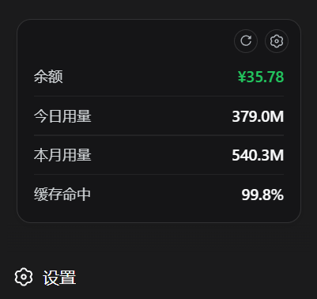
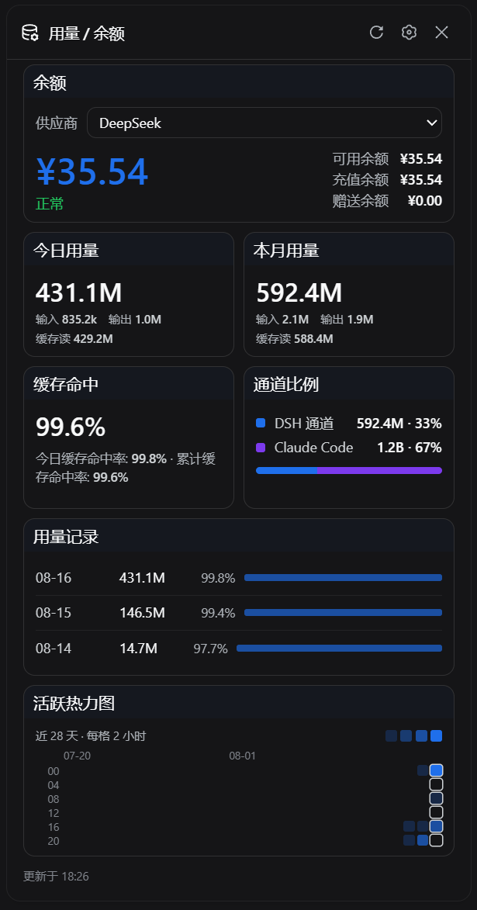
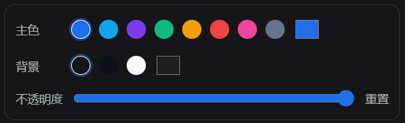

# dsh-usage

为 [DeepSeek Harness](https://github.com/deepseek-ai/deepseek-harness) 网页端提供**常驻悬浮窗**、**可完全自定义的余额 / 用量面板**、**活跃热力图**与**双边用量对比**的 bundle 插件。

A persistent floating dock plus a fully customizable balance / token-usage panel, an activity heatmap, and a dual-channel comparison for the DeepSeek Harness Web GUI (`dsh web`).

## ✨ 功能速览 / Feature tour

### 🌊 常驻悬浮窗 / Persistent dock

余额常绿、欠费才红；分隔线分区，右上角 ⚙ 开详情、↻ 一键刷新；sidebar 收起时自动退化为小巧的余额胶囊。

The dock keeps your key numbers always visible — balance glows green (red only when out of credit), with a settings gear and one-click refresh in the corner; it collapses into a tiny balance pill when the sidebar is folded.

<table><tr>
<td width="44%"></td>
<td>

- 🟢 余额 / Balance — green when healthy, red when drained
- 📊 今日 / 本月 / 命中 — today, month, cache-hit at a glance
- ⚙ 齿轮开详情 · ↻ 一键刷新 — gear opens the panel, refresh re-queries
- 🧲 内容随设置同步 — mirrors your pin choices instantly

</td>
</tr></table>

### 🎛️ 详情面板 / Detail panel

两列卡片布局：余额全宽（左大数字 + 右明细三行），今日与本月、命中与通道比例两两成行；抓手拖拽排序（虚线占位 + 平滑让位），操作按钮悬停才浮现；主色 / 背景 / 透明度全部可调。

A two-column card layout: full-width balance (big number left, breakdown right), today/month and cache-hit/channel-share paired per row; drag any card to reorder (dashed placeholder + glide animation), hover to reveal actions; accent, background, and opacity are fully customizable.

<table><tr>
<td>

- 🧩 七个 widget 各具繁简双表达 — seven widgets, detail + compact forms
- ✋ 拖拽排序 · 折叠 · 隐藏 · pin — drag-reorder, collapse, hide, pin
- 🎨 主题引擎：主色 / 背景 / 不透明度 — theme engine with live preview
- ↔️ 通道比例：DSH × Claude Code — dual-channel share comparison

</td>
<td width="44%"></td>
</tr></table>

### 🔥 活跃热力图 / Activity heatmap

GitHub 风格点块：横轴近 28 天（顶部标日期），纵轴 0–24 时（6 段 × 4 小时），主色深浅即使用频率。

GitHub-style dot grid: 28 days across (date labels on top) × 0–24h in six 4-hour bands; deeper accent = heavier usage.

<p align="center"></p>

## 一眼看懂

| | 能力 | 说明 |
| --- | --- | --- |
| 💳 | 常驻悬浮窗 | 左下角 dock 常显 pinned 项（余额、今日、本月、缓存命中），行间分隔线、角落齿轮与刷新钮；sidebar 收起时退化为单个余额胶囊按钮，点击展开 |
| 🎨 | 一切皆可自定义 | 每个功能是独立 widget：pin、折叠、隐藏/恢复、**抓手拖拽排序**（虚线占位 + 平滑让位动画）、操作按钮悬停显现；主色调（预设+取色器）、背景色、面板不透明度均可调，设置持久化 localStorage |
| 📊 | 余额与用量面板 | 详情面板：账户卡片（供应商切换 + 余额明细）、今日/本月/累计 Token（k/M/B 紧凑单位）、缓存命中率、用量记录与按模型下钻 |
| 🔥 | 活跃热力图 | GitHub 风格点块：近 28 天 × 6 时段（每格 4 小时）+ 顶部日期标签，主色深浅表示使用频率 |
| ↔️ | 通道比例 | DSH 通道 vs Claude Code 通道（解析 `~/.claude/projects` JSONL 增量聚合）用量占比与分布 |
| 🔄 | 后台刷新 | 服务端启动即刷新，之后每 5 分钟更新余额、DSH Token 与 Claude Code 聚合 |
| 🔒 | 本机安全边界 | 三个端点仅接受回环 GET；凭据只在服务端解析；上游强制 HTTPS、拒绝私网解析并固定 DNS 连接；Claude 日志只聚合数字，对话文本永不落盘 |

界面支持中文和英文。凭据由 Harness 从 `~/.dsh/.credentials.yaml` 解析，插件不读取、不缓存、不回传任何密钥。

## 快速安装

需要 DeepSeek Harness `web` profile（`@deepseek-ai/dsh >= 0.1.0-rc.6`）。

本地目录开发安装（link 协议，改代码无需重装）：

```bash
dsh plugin --profile web add "E:/path/to/DSH-Usage"
```

远程安装（发布到 GitHub 后）：

```bash
dsh plugin --profile web add "github:<owner>/dsh-usage"
```

重启 `dsh web` 并在浏览器硬刷新，左下角出现常驻悬浮窗。更新 / 卸载：

```bash
dsh plugin --profile web update dsh-usage
dsh plugin --profile web remove dsh-usage
```

## 凭据配置

余额型供应商的凭据引用，全部写在 `~/.dsh/.credentials.yaml`：

```yaml
DEEPSEEK_API_KEY: sk-your-key-here            # DeepSeek 官方路由
OPENROUTER_MANAGEMENT_KEY: sk-or-v1-...       # OpenRouter 账户（需要 Management Key，不是推理 Key）
ZAI_API_KEY: your-zai-key                     # Z.ai 开放平台
```

Moonshot / Kimi 等 `llm-pi-ai` 中的 provider profile 会自动发现并复用其 `apiKeyEnv`。没有公开余额接口的供应商显示「无公开余额接口」，不会猜测。

## 支持的供应商

| Provider | 上游接口 | 默认凭据引用 |
| --- | --- | --- |
| DeepSeek | `GET {origin}/user/balance` | `DEEPSEEK_API_KEY` |
| OpenRouter | `GET {origin}/api/v1/credits` | `OPENROUTER_MANAGEMENT_KEY` |
| Moonshot / Kimi | `GET {origin}/v1/users/me/balance` | pi-ai provider `apiKeyEnv` |
| Z.ai / 智谱 | `GET {origin}/api/paas/v4/balance` | `ZAI_API_KEY` |

## API

| Method | Path | Response |
| --- | --- | --- |
| `GET` | `/api/usage/providers` | provider 列表、余额 scheme 与状态摘要 |
| `GET` | `/api/usage/balance?provider=<id>` | 统一余额快照；`refresh=1` 强制刷新上游 |
| `GET` | `/api/usage/usage` | 按日期/provider/model 聚合的 Token、缓存命中率、24 小时桶（`days[].hours`）与 Claude Code 通道（`claude`） |

非 GET 返回 `405`，非回环请求返回 `403`；所有响应均为 JSON 并带 `Cache-Control: no-cache`。

## 与 dsh-usage-stats 并存

本插件与 [dsh-usage-stats](https://github.com/Ychris12138/dsh-usage-stats) 可同时安装：路由前缀（`/api/usage/` vs `/api/usage-stats/`）、缓存文件（`usage-cache.json` vs `usage-stats-cache.json`）、slot 注册 id（`usage` vs `usage-stats`）均不冲突。本插件的 Token 统计口径与 dsh-usage-stats 一致（provider-reported usage，同 turn/step 替换语义），迁移无痛。

## 开发与验证

```bash
npm install           # 仅 react/react-dom/jsdom 用于离线测试
npm run check         # 全量语法检查
npm test              # 81 个离线测试：余额 scheme、token 折叠、服务端边界、客户端、e2e 交互流、Claude 聚合
```

所有测试完全离线，不访问网络、不触碰真实 `~/.dsh`（服务端测试重定向 `DSH_HOME` 到临时目录）。真实 Claude 数据预演：`node scripts/validate-claude.mjs`。

## 隐私与安全

- API Key 永不进入浏览器响应、插件缓存或日志；凭据由 Harness credentials seam 在请求时解析。
- 上游余额查询：强制 HTTPS、预解析 DNS 并拒绝回环/私网/链路本地/组播等非公网地址、连接固定到校验过的地址（防 DNS rebinding）、响应上限 1 MiB、超时 15 秒。
- 用量缓存 `~/.dsh/storages/usage-cache.json` 只保存聚合 Token 与会话折叠游标，不保存提示词或回复内容。
- 请勿将本插件端点经反向代理暴露到局域网或公网。

## 致谢 / Credits

- [Ychris12138/dsh-usage-stats](https://github.com/Ychris12138/dsh-usage-stats)（MIT）：余额 scheme 与 Token 折叠语义、DSH bundle 插件结构与安全边界的参考实现。

## License

[MIT](LICENSE)
