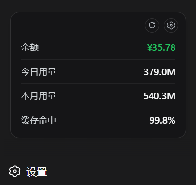
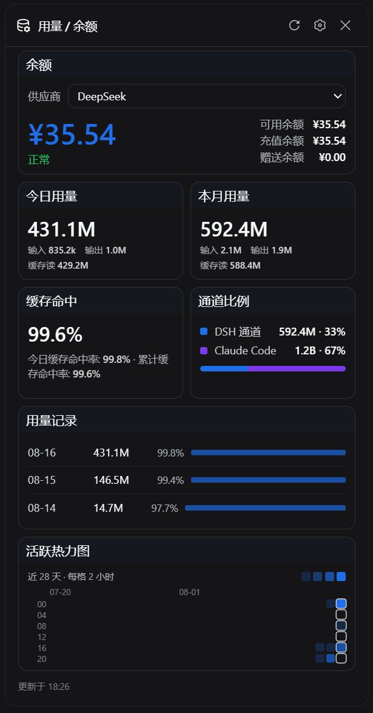
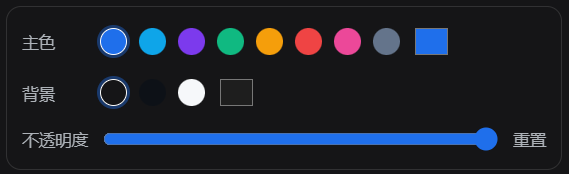

# 🌊 dsh-usage

为 [DeepSeek Harness](https://github.com/deepseek-ai/deepseek-harness) 网页端（`dsh web`）与 Windows 官方桌面端提供**常驻悬浮窗**、**完全可自定义的余额 / 用量面板**、**活跃热力图**与**双边通道用量对比**的 bundle 插件。具体宿主范围见下方说明。

[](README.md)
[](LICENSE)

## ✨ 功能速览

### 🌊 常驻悬浮窗

你关心的数字始终可见——余额常绿（欠费才变红），行间细线分隔，右上角 ⚙ 打开详情、↻ 一键刷新；sidebar 收起时自动折叠成一枚小巧的余额胶囊。

<table><tr>
<td width="44%"></td>
<td>

- 🟢 **余额** — 健康时绿色，欠费时红色
- 📊 **今日 / 本月 / 缓存命中** — 一眼尽收的用量数字
- ⚙ **齿轮开详情** · ↻ 一键刷新
- 🧲 **与 pin 设置同步** — 每次调整立即生效

</td>
</tr></table>

### 🎛️ 详情面板 — 七个 widget 全览

两列卡片布局；每个 widget 都有「详情 + 悬浮」两种表达，支持拖拽排序、折叠、隐藏、pin。

<table><tr>
<td>

| Widget | 功能 |
| --- | --- |
| 💳 **余额** | 左侧大数字 + 右侧「可用 / 充值 / 赠送」三行明细，供应商可切换 |
| 📊 **今日用量** | 今日 token 总数 + 输入 / 输出 / 缓存读分桶 |
| 📈 **本月用量** | 本月累计 token + 同样的分桶明细 |
| 🎯 **缓存命中** | 今日与累计缓存命中率 |
| ↔️ **通道比例** | DSH 通道 vs Claude Code 通道的占比条 |
| 📜 **用量记录** | 近 14 天按日列表，点击下钻到模型明细 |
| 🔥 **活跃热力图** | 28 天 × 6 时段点块网格（横轴日期，纵轴 0–24 时） |

</td>
<td width="46%"></td>
</tr></table>

### 🎨 一切皆可自定义

主色调（预设色板 + 取色器）、背景色、面板不透明度随时可调；拖拽排序、pin、折叠、隐藏——每个数字都按你的方式呈现，正如 DeepSeek Harness 的「一切皆插件」。

<p align="center"></p>

## 一眼看懂

| | 能力 | 说明 |
| --- | --- | --- |
| 💳 | 常驻悬浮窗 | pinned 项始终可见；sidebar 收起时折叠为余额胶囊按钮 |
| 🎨 | 一切皆可自定义 | 每个 widget 可 pin / 折叠 / 隐藏 / 拖拽排序（虚线占位 + 平滑让位动画）；主色、背景、不透明度可调；设置持久化 localStorage |
| 📊 | 余额与用量面板 | 供应商切换、余额明细、今日/本月总量（k/M/B 紧凑单位）、缓存命中、用量记录与按模型下钻 |
| 🔥 | 活跃热力图 | GitHub 风格点块：28 天 × 6 时段（每格 4 小时）+ 顶部日期标签 |
| ↔️ | 通道比例 | DSH 通道 vs Claude Code 通道（解析 `~/.claude/projects` JSONL 增量聚合） |
| 🔄 | 后台刷新 | 启动即刷新，之后每 5 分钟更新余额、DSH Token 与 Claude Code 聚合 |
| 🔒 | 本机安全边界 | 三个端点仅接受回环 GET；凭据只在服务端解析；上游强制 HTTPS、拒绝私网解析并固定 DNS 连接；Claude 日志只聚合数字，对话文本永不落盘 |

界面支持中文和英文。余额查询通过 Harness 凭据服务在内存中取得密钥，密钥不写入插件缓存或浏览器响应。

## 快速安装

**v0.3.1 面向 DeepSeek Harness 0.2.0-rc.2** 的网页端与 Windows 官方桌面端。旧接口分支保留，但尚未完成 0.1.x 宿主整套回归；旧宿主用户请先保留 v0.3.0，不把本版视为对所有 DSH 版本的兼容保证。Windows 之外的桌面平台未做真机验收。

桌面沿用客户端 `platform: web` 契约，但安装应使用该应用自带 CLI 与 `desktop` profile，安装前须完整退出，之后手动重新打开，不自动杀进程或重启。升级提示会按当前环境选择 profile；两端即使共享 DSH_HOME，插件外观设置也按浏览器来源分别保存。离线测试不等于所有账号、所有历史会话与桌面功能均已验收。

```bash
dsh plugin --profile web add "github:Aisland-SJL/dsh-usage"
```

也可安装 Release 的固定名 TGZ（发版后可用；需要可复现安装时可改用对应 tag 下的版本化资产）：

```bash
dsh plugin --profile web add "https://github.com/Aisland-SJL/dsh-usage/releases/latest/download/dsh-usage.tgz"
```

桌面端先完整退出，再用**该桌面端自带的 dsh CLI** 执行下列命令；不要用网页端 CLI 修改桌面 profile：

```bash
dsh plugin --profile desktop add "https://github.com/Aisland-SJL/dsh-usage/releases/latest/download/dsh-usage.tgz"
```

本版声明运行时依赖 `@deepseek-ai/dsh-client-ui-primitives@0.2.0-rc.2`，正常包安装由包管理器解析，不需手工补装官方组件。使用 `link:` 时先核对活动 profile 的依赖与宿主版本；不要为消除警告把另一版本官方界面组件装进宿主。

网页端安装后完整重启 `dsh web` 并硬刷新；桌面端手动重新打开。用 GitHub 来源安装的更新 / 卸载命令如下（TGZ 来源升级请重新执行对应的 `add` 命令）：

```bash
dsh plugin --profile web update dsh-usage
dsh plugin --profile web remove dsh-usage
```

## 凭据配置

请通过 Harness 配置凭据引用。旧宿主使用过 `~/.dsh/.credentials.yaml`，新版或自定义 `DSH_HOME` 不应按此路径手工猜测：

```yaml
DEEPSEEK_API_KEY: sk-your-key-here            # DeepSeek 官方路由
OPENROUTER_MANAGEMENT_KEY: sk-or-v1-...       # OpenRouter 账户（需要 Management Key，不是推理 Key）
ZAI_API_KEY: your-zai-key                     # Z.ai 开放平台
```

Moonshot / Kimi 等 `llm-pi-ai` 中的 provider profile 会自动发现并复用其 `apiKeyEnv`。没有公开余额接口的供应商显示「无公开余额接口」，不会猜测。

0.2 按供应商目录的条目 id 读取已脱敏的实时设置；支持的 pi-ai 路由也可通过凭据服务读取 API-key 类型记录，不解释 OAuth/grant。OpenRouter 仍需要 Management Key，不能拿已存的推理密钥替代；缺少端点或可用凭据时明确显示未配置，不借用其他路由的密钥。

隔离测试可在插件条目设置 `config.balanceEnabled: false`，停止凭据解析与上游余额请求（默认仍开启）。必须显式将 `CLAUDE_CONFIG_DIR` 指向合成测试目录，否则原有默认行为仍扫描 `~/.claude/projects`。用量缓存升级为 v4，旧版缓存自动重算。0.2 上未变化的会话复用缓存、变化的会话经只读 handle 重新折叠，fork 继承历史不重复计费。真实余额和付费模型调用仍需独立验收。

单条会话读不过时不再拖垮其余统计。响应的 `coverage` 描述宿主列出的会话，区分完整、部分与不可用，并列出纳入/未纳入的会话。部分统计显示明确告警和仅可读小计（≥）；全部读不过时 `total: null`、界面显示「—」，不按零计算。失败记录清除旧小计、下次重试；这不等于修复宿主对旧格式的兼容，也不改写旧日志。会话列表整体读取失败仍返回错误。

## 支持的供应商

| Provider | 上游接口 | 默认凭据引用 |
| --- | --- | --- |
| DeepSeek | `GET {origin}/user/balance` | `DEEPSEEK_API_KEY` |
| OpenRouter | `GET {origin}/api/v1/credits` | `OPENROUTER_MANAGEMENT_KEY` |
| Moonshot / Kimi | `GET {origin}/v1/users/me/balance` | pi-ai provider `apiKeyEnv` |
| Z.ai / 智谱 | `GET {origin}/api/paas/v4/balance` | `ZAI_API_KEY` |

## API

| Method | Path | Response |
| --- | --- | --- |
| `GET` | `/api/usage/providers` | provider 列表、余额 scheme 与状态摘要 |
| `GET` | `/api/usage/balance?provider=<id>` | 统一余额快照；`refresh=1` 强制刷新上游 |
| `GET` | `/api/usage/usage` | 按日期/provider/model 聚合的 Token、缓存命中率、24 小时桶（`days[].hours`）、统计覆盖情况（`coverage`）与 Claude Code 通道（`claude`） |

非 GET 返回 `405`，非回环请求返回 `403`；所有响应均为 JSON 并带 `Cache-Control: no-cache`。

## 开发与验证

```bash
npm install           # 仅 react/react-dom/jsdom 用于离线测试
npm run check         # 全量语法检查
npm test              # 112 个离线测试：余额 scheme、token 折叠、服务端边界、客户端、e2e 交互流、Claude 聚合、发布与 0.2 契约
npm run test:package # 运行时依赖与 client inject 契约
```

所有测试完全离线，不访问网络、不触碰真实 `~/.dsh`（服务端测试重定向 `DSH_HOME` 到临时目录）。真实 Claude 数据预演：`node scripts/validate-claude.mjs`。

## 隐私与安全

- API Key 永不进入浏览器响应、插件缓存或日志；凭据由 Harness credentials seam 在请求时解析。
- 上游余额查询：强制 HTTPS、预解析 DNS 并拒绝回环/私网/链路本地/组播等非公网地址、连接固定到校验过的地址（防 DNS rebinding）、响应上限 1 MiB、超时 15 秒。
- 用量缓存 `~/.dsh/storages/` 只保存聚合 Token 与会话折叠游标，不保存提示词或回复内容。
- Claude Code 日志逐行解析即弃，只有聚合数字进入缓存。
- 请勿将本插件端点经反向代理暴露到局域网或公网。

## 致谢

- [Ychris12138/dsh-usage-stats](https://github.com/Ychris12138/dsh-usage-stats)（MIT）：余额 scheme 与 Token 折叠语义、DSH bundle 插件结构与安全边界的参考实现。

## License

[MIT](LICENSE)
